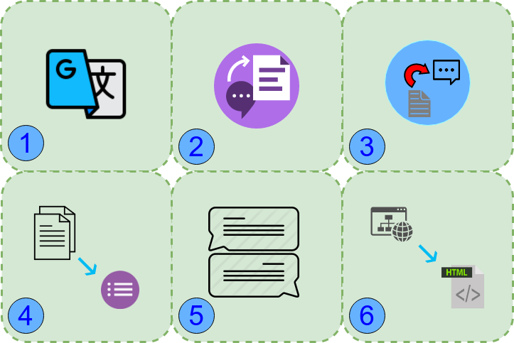

# How this blog series is different?
This is not just an ordinary blog a where I will show you some equation and sign off. This is an end to end blog series about Sequence to Sequence, We will start off with general Sequence to Sequence architecture, then one by one we will implement vanilla Encoder Decoder, [attention](https://arxiv.org/abs/1706.03762), [beam search](https://guillaumegenthial.github.io/sequence-to-sequence.html), batch processing with attention, [Pointer networks](https://arxiv.org/abs/1506.03134). A series of the blog where algorithm, equations, and Implementation will be parallelly covered. 

**Sequence to Sequence is one size fit all kind of algorithm which is used in all below given tasks:**

- Machine Translation
- Summarization
- Question Answering
- chit chatbot
- Text Simplification
- image to code
- Speech to text
- text to speech

Figure 1. Symbolic representation showing different application of sequence to sequence network.

I am very sure you will find hundreads of blogs with thsese topics, but there are very few which are actually helps in learning, many of them are just showing equations as copied from original papers. many will just throw code and wont help in understanding given step was implemented, what equations are governing the flow. Many will show you implementation but you wont be able to reproduce or reuse that implementation in your pipeline (bugs :bug: ?? errors ?? questionable extensibility..).
In present series we will be using PyTorch as is having intuitive model building approaches. It is easy to understand and debug code with PyTorch.

