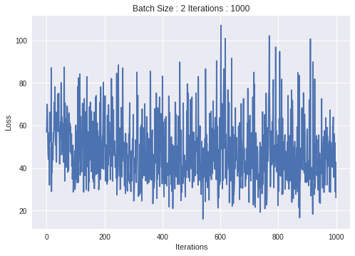
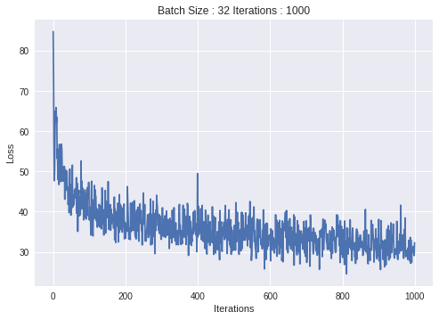

In order to understand this tutorial you need to first understand [how sequence to sequence architecture can be implemented with batching](https://colab.research.google.com/drive/11OwyUDw5PFe9Uoam_N1n_IxWxearOnDv). In this tutorial I will be implementing the same sequence to sequence network, but his time I will be using baching. Batching efficiently utilize the power is parallel hardware such as GPU. In previous tutorial i have in detail illustrated how baching works with Sequence to sequence. In this tutorial we will be using same encoder and decoder and with little modification in data pipline, we able to achiieve our goal. 

This tutorial will also demonstrate effect of batch size on learning. For our case you will see that batch size 32 is computationally **10X** more efficient then batch size 2.

# Environment Setup
Installing Pytorch , tqdm. I am also installing **gputil** which will help me to monitor GPU memory usage. 


```python
!pip install torch==0.4.1 -q
!pip install tqdm -q
!pip install gputil -q
```


```python
from tqdm import tqdm
import numpy as np
from io import open
import random
import time
import math
import torch
import torch.nn as nn
from torch.autograd import Variable
import torch.utils.data as Data
from torch import optim
import matplotlib.pyplot as plt
import torch.nn.functional as F
import GPUtil
```

I am using the same dataset which I used in previous tutiorials.  The data for this tutorial is a set of many thousands of French to English translation pairs. These pairs are shared from http://www.manythings.org/anki/fra-eng.zip.


```bash
!wget -c http://www.manythings.org/anki/fra-eng.zip
!unzip fra-eng.zip
```

I am running this experiment on google colaboratory and it offers Tesla K80 GPU for frre which is having 12 GB of GPU RAM (gddr5)


```
GPUtil.showUtilization(all=True)
```

    | ID | Name      | Serial        | UUID                                     || GPU util. | Memory util. || Memory total | Memory used | Memory free || Display mode | Display active |
    --------------------------------------------------------------------------------------------------------------------------------------------------------------------------------------
    |  0 | Tesla K80 | 0320816053548 | GPU-ba246ac3-0538-3969-a73a-655de18b226f ||        0% |           0% ||      11441MB |         0MB |     11441MB || Disabled     | Disabled       |


Below given code snippet helps to choose GPU if avaialbe else CPU. Here we have  choosen GPU as runtime from **Runtime** -> **Change Runtime Type**, hence we will get GPU as default device. CUDA is programming langauge supported by NVIDIA GPU  and will help us in running our computations on GPU.


```python
device = torch.device("cuda:0" if torch.cuda.is_available() else "cpu")
print("Device of choice : ",device)

```

> Device of choice :  cuda:0


Not to reinvent the wheel, I am using preprocessing code used in official tutoral of the  [Pytorch](https://github.com/pytorch/tutorials), With little modification in this code we will be able to use in our case.

# Pre-Processing


```python
import re
import unicodedata
import torch


MIN_LENGTH = 0
MAX_LENGTH = 20

SOS_token = 1
EOS_token = 2


class Lang:
    def __init__(self, name):
        self.name = name
        self.word2index = {}
        self.word2count = {}
        self.index2word = {0: "PAD", 1: "SOS", 2: "EOS"}
        self.n_words = 3
        self.trimmed = False

    def register_sentence(self, sentence):
        """Register all words in sentence."""
        for word in sentence.split(' '):
            self.register_word(word)

    def register_word(self, word):
        """Register word to dictionary."""
        if word not in self.word2index:
            self.word2index[word] = self.n_words
            self.word2count[word] = 1
            self.index2word[self.n_words] = word
            self.n_words += 1
        else:
            self.word2count[word] += 1

    def trim(self, min_count=MIN_LENGTH):
        """Remove non-frequent word in word2index."""
        if self.trimmed:
            return

        keep_words = [k for k, v in self.word2count.items() if v >= min_count]
        prev_words = len(self.word2index)
        cur_words = len(keep_words)
        print('Keep words %d / %d = %.4f' % (
            cur_words, prev_words, cur_words/prev_words))

        # Reinitialize dictionary
        # TODO: Is it OK to remove `word2count`????
        self.word2index = {}
        self.word2count = {}
        self.index2word = {0: "PAD", 1: "SOS", 2: "EOS"}
        self.n_words = 3
        self.trimmed = True

        for word in keep_words:
            self.register_word(word)

    def indexes_from_sentence(self, sentence):
        """Return a list of indexes, one for each word in the sentence."""
        return [self.word2index[word] for word in sentence.split(' ')] + [EOS_token]

# Turn a Unicode string to plain ASCII, thanks to http://stackoverflow.com/a/518232/2809427
def unicode_to_ascii(s):
    return ''.join(
        c for c in unicodedata.normalize('NFD', s)
        if unicodedata.category(c) != 'Mn')


# Lowercase, trim, and remove non-letter characters
def normalize_string(s):
    s = unicode_to_ascii(s.lower().strip())
    s = re.sub(r"([.!?])", r" \1", s)
    s = re.sub(r"[^a-zA-Z.!?]+", r" ", s)
    return s


def read_langs(lang1, lang2, reverse=False):
    print("[Data] Reading lines...")

    # Read the file and split into lines
    filename = 'fra.txt'
    lines = open(filename).read().strip().split('\n')

    # Split every line into pairs and normalize
    pairs = [[normalize_string(s) for s in l.split('\t')] for l in lines]

    # Reverse pairs, make Lang instances
    if reverse:
        pairs = [list(reversed(p)) for p in pairs]
        input_lang = Lang(lang2)
        output_lang = Lang(lang1)
    else:
        input_lang = Lang(lang1)
        output_lang = Lang(lang2)

    return input_lang, output_lang, pairs


def filter_pair(p):
    return len(p[0].split(' ')) < MAX_LENGTH and \
            len(p[1].split(' ')) < MAX_LENGTH and \
            len(p[0].split(' ')) >= MIN_LENGTH and \
            len(p[1].split(' ')) >= MIN_LENGTH


def filter_pairs(pairs):
    return [pair for pair in pairs if filter_pair(pair)]


def prepare_data(lang1_name, lang2_name, reverse=False):
    # Load data
    input_lang, output_lang, pairs = read_langs(lang1_name, lang2_name, reverse)
    print("[Data] Read %s sentence pairs." % len(pairs))

    # Filter not good sentence
    pairs = filter_pairs(pairs)
    print("[Data] Trimmed to %s sentence pairs." % len(pairs))

    # Register word into dictionary
    for pair in pairs:
        input_lang.register_sentence(pair[0])
        output_lang.register_sentence(pair[1])
    print("[Data] Complete registering word into Lang.")

    # Remove non-frequent word in the Lang
    input_lang.trim()
    output_lang.trim()

    # Remove pair which contain non-registered word.
    keep_pairs = []
    for pair in pairs:
        input_sentence, output_sentence = pair

        contain = map(lambda x: x in input_lang.word2index, input_sentence.split())
        keep_input = all(contain)

        contain = map(lambda x: x in output_lang.word2index, output_sentence.split())
        keep_output = all(contain)

        if keep_input and keep_output:
            keep_pairs.append(pair)
    pairs = keep_pairs
    print("[Data] Trimmed useless word.")

    return input_lang, output_lang, pairs


```

Below given is the small modification in the preprocessing script that will help us to get equal size random batches. `pad_seq` function will append **PAD token (0)** to make all sentence equel in  given batch of source and token languages. `random_batch` function will fetch source language and target language sentence of given batch size.


```python
def pad_seq(seq, max_length):
    seq += [0 for i in range(max_length - len(seq))]
    return seq
```


```python
def random_batch(batch_size=3):
    input_list = []
    target_list = []

    # Choose random pairs
    for _ in range(batch_size):
        pair = random.choice(pairs)
        input_list.append(input_lang.indexes_from_sentence(pair[0]))
        target_list.append(output_lang.indexes_from_sentence(pair[1]))

    # Sort by length
    tmp_pairs = sorted(zip(input_list, target_list), key=lambda p: len(p[0]), reverse=True)
    input_seqs, target_seqs = zip(*tmp_pairs)

    # For input and target sequences, get array of lengths and pad with 0s to max length
    input_lengths = [len(s) for s in input_seqs]
    target_lengths = [len(s) for s in target_seqs]
    max_input_target = max(input_lengths+target_lengths)
    input_padded = [pad_seq(s, max_input_target) for s in input_seqs]
    target_padded = [pad_seq(s, max_input_target) for s in target_seqs]

    # Create tensor using padded arrays into (batch x seq) tensors
    input_var = torch.LongTensor(input_padded,device = device)
    target_var = torch.LongTensor(target_padded , device = device)

    return input_var, target_var
```


```python
input_lang, output_lang, pairs = prepare_data('eng', 'fra', True)
```
>    [Data] Reading lines...
    [Data] Read 160872 sentence pairs.
    [Data] Trimmed to 160036 sentence pairs.
    [Data] Complete registering word into Lang.
    Keep words 22132 / 22132 = 1.0000
    Keep words 13451 / 13451 = 1.0000
    [Data] Trimmed useless word.


```python
input_size = input_lang.n_words
output_size = output_lang.n_words
print(" Total words in  Input Language : %s | Total words in Output Langauge : %s "%(input_size, output_size))
```

> Total words in  Input Language : 22135 | Total words in Output Langauge : 13454 


Finally to get Source and Target laguage pairs of batch size 5 is can be retrived by using `random_batch`.


```
Input, Output = random_batch(5)
print(" Input Language batch size : %s | Output Langauge batch size : %s "%(Input.shape, Output.shape))
```

> Input Language batch size : torch.Size([5, 20]) | Output Langauge batch size : torch.Size([5, 20]) 


```python
# function to plot loss as training progress
def showPlot(points, title = ""):
    plt.figure()
    plt.xlabel("Iterations")
    plt.ylabel("Loss")
    plt.title(title)
    x = np.arange(len(points))
    plt.plot(x, points)
    plt.show()
```

# Encoder 
In Encoder and Decoder I have used Dropout as an additional operation to add regularize learning. More precisely Dropout is applied while training only. More over here you see one more modification **"to(device)"**, to(device) help to transfer that object/ data to GPU and further computation takes place in defined device. *If GPU was not available the computation would takes place in CPU without any error.*


``` python
class EncoderRNN(nn.Module):
    def __init__(self, input_size, hidden_size, n_layers=1):
        super(EncoderRNN, self).__init__()
        self.n_layers = n_layers
        self.hidden_size = hidden_size
        self.embedding = nn.Embedding(input_size, hidden_size)
        self.gru = nn.GRU(hidden_size, hidden_size,num_layers=n_layers)
        self.drop = nn.Dropout(0.2)

    def forward(self, input, batch_size, hidden, training=True):
        embedded = self.embedding(input).unsqueeze(1) #Input =  64, 26 --->  #Output  64, 26, 128
        if training == True:
            embedded = self.drop(embedded)
        embedded = embedded.view(-1, batch_size, self.hidden_size)#Input = 64, 26, 128  --- > #Output =  26, 64, 128
        output = embedded
        output, hidden = self.gru(output, hidden)
        return output, hidden #Output 26, 64, 128  #encoder Hidden = 1, 64, 128

    def initHidden(self, batch_size):
        result = Variable(torch.zeros(1, batch_size, self.hidden_size, device=device))
        result = nn.init.xavier_normal_(result)
        return result
```

# Decoder


```python
class DecoderRNN(nn.Module):
    def __init__(self, hidden_size, output_size, n_layers=1):
        super(DecoderRNN, self).__init__()
        self.n_layers = n_layers
        self.hidden_size = hidden_size
        self.embedding = nn.Embedding(output_size, hidden_size)
        self.gru = nn.GRU(hidden_size, hidden_size,num_layers = n_layers)
        self.out = nn.Linear(hidden_size, output_size)
        self.softmax = nn.LogSoftmax(dim=1)
        self.drop = nn.Dropout(0.2)

    def forward(self, input, batch_size, hidden,training=True):
        embedded = self.embedding(input)  # Input =  1,64, 52 --->  #Output  64, 128
        if training == True:
            embedded = self.drop(embedded)
        embedded = embedded.unsqueeze(1).view(-1, batch_size,self.hidden_size)  # Input = 64, 1, 128  --- > #Output =  52, 64, 128
        output = embedded
        output = F.relu(output)
        output, hidden = self.gru(output, hidden)
        output = self.softmax(self.out(output[0]))
        return output, hidden #Output 26, 64, 128  #encoder Hidden = 1, 64, 128

    def initHidden(self, batch_size):
        result = Variable(torch.empty(1, batch_size, self.hidden_size, device=device))
        result = nn.init.xavier_normal_(result)
        return result
```

# Loss function for Sequece to Sequence
In a batch all sequecne are not of same length. So we must not calculate loss for padding (OR PAD) tokens added to input batches. To avoid this, a masked loss is calculated. In addition to PAD sometime EOS (End of Sequence) is added. Normal NLLLoss is calculated and loss corresponding to PAD is made to zero by masking. Resultant loss will be equavalent to average of loss derived by deviding total loss by total non-PAD tokens.


```python
class customLoss(nn.Module):
    def __init__(self,tag_pad_token = 1):
        super(customLoss, self).__init__()
        self.tag_pad_token = tag_pad_token

    def forward(self,logits, target):  
        target_flat = target.view(-1)
        mask = target_flat >= self.tag_pad_token
        loss = nn.NLLLoss(reduce=False)(logits,target)
        loss = loss*mask.float()
        result = loss.sum()/len(target)
        return result
```


```python
NLL = customLoss(2).to(device)
```

Below given are two functions to test using given model and get output while training.No buddy writes **Evaluate** function before training but for to use these function to evaluate training progress it is required to initialize them before training begins.*Evaluate function are almost simillar to training function, it just we dont calculate loss and optimize parameters while evaluating*.


```python
def evaluate(input_batches, target_batches,batch_size):
    in_lang = input_batches
    out_lang = target_batches
    output = []
    # Passing data to Encoder 
    encoder_hidden = encoder.initHidden(batch_size)
    in_lang = in_lang.permute(1, 0)
    for encoder_input in in_lang:
        encoder_output, encoder_hidden = encoder(encoder_input.to(device), batch_size, encoder_hidden, training=False)
    decoder_input = Variable(torch.LongTensor(torch.tensor([SOS_token]).repeat(batch_size)))
    decoder_hidden = encoder_hidden
    out_lang = out_lang.permute(1, 0)
    output_lang_sent = []
    for di in range(len(out_lang)):
        decoder_output, decoder_hidden = decoder(decoder_input.to(device), batch_size, decoder_hidden, training=False)
        top1 = decoder_output.data.argmax(dim=1)
        decoder_input = top1.unsqueeze(1)
        output.append([output_lang.index2word[int(x)] for x in top1])
    output = np.array(output)
    return(output.T)
```


```python
def testify(batch_size = 2):
    input_batches, target_batches = random_batch(batch_size)
    predicted_words = evaluate(input_batches, target_batches,batch_size)
    input_words = []
    target_words = []

    for row in input_batches:
        input_words.append([input_lang.index2word[int(cols)] for cols in row])

    for row in target_batches:
        target_words.append([output_lang.index2word[int(cols)] for cols in row])

    for input, target, predicted in zip(input_words,target_words,predicted_words):
        print ("- Input : "," ".join(input))
        print ("- Target : "," ".join(target))
        print ("- Predicted : "," ".join(predicted))
```

Now I will be combining all parts of the implementations in to one function and this `train_it` function takes 6 inputs. 

1.  Encoder Object
2.  Decoder Object
3.  Batch size : This parameter will help us in looking at effect of Batch size on training.
4.  Iterations : Number of random batch used to train model.
5.  test : To Evaluate by using random samples while training
6.  plot : To plot progress  

In present implementation I will be using **learning rate 0.0001** and **RMSprop  optimizer**.


```python
hidden_size = 128
```


```python
def train_it(encoder,decoder,batch_size, iterations, test = True, plot = False):
    # Collecting all trianable parameters
    param = list(encoder.parameters()) + list(decoder.parameters())
    # Defining Optimizer
    optimizer = optim.RMSprop(param, lr=1e-3, momentum=0.9)
    # Defining Loss Function
    teacher_forcing = 0.5
    loss = 0
    plot_losses = []
    for iteration in range(iterations):
        loss = 0
        teacher_forcing_prob = random.random()

        input_batches, target_batches = random_batch(batch_size)
        in_lang = Variable(input_batches)
        out_lang = Variable(target_batches)
        # Passing data to Encoder 
        encoder_hidden = encoder.initHidden(batch_size)
        in_lang = in_lang.permute(1, 0)

        for encoder_input in in_lang:
            encoder_output, encoder_hidden = encoder(encoder_input.to(device), batch_size, encoder_hidden)

        decoder_hidden = encoder_hidden
        decoder_input = Variable(torch.LongTensor(torch.tensor([SOS_token]).repeat(batch_size)).to(device))

        out_lang = out_lang.permute(1, 0)
        for di in range(len(out_lang)):
                decoder_output, decoder_hidden = decoder(decoder_input.to(device), batch_size, decoder_hidden)
                top1 = decoder_output.data.argmax(dim=1)
                decoder_input = Variable(torch.tensor(out_lang[di].unsqueeze(1)))
                loss +=  NLL(torch.tensor(decoder_output, device=device), torch.tensor(out_lang[di],device=device)) 

        optimizer.zero_grad()
        loss.backward()
        optimizer.step()
        plot_losses.append(loss)    

        if (test == True):
            if iteration%1000 == 0:
                print("Iteration : ", iteration, " _______ ","Loss : ", loss )
                testify()
    if(plot == True):
        title = "Batch Size : "+ str(batch_size) + " Iterations : "+str(iterations)
        showPlot(plot_losses,title)
```

As a rule of thumb one should use batch size between 4 to 64. You may read more about choosing optimum batch size from [here](https://stats.stackexchange.com/questions/164876/tradeoff-batch-size-vs-number-of-iterations-to-train-a-neural-network)
Next is we will be using batch size 2. It is clear from the plot of loss vs Iteration that  loss is not decreasing and hence no learning is taking place. With lower batch size then optimum one it will take more time to get trained.

**%%time** helps in watching time utilized by perticular cell in iPython Notebook


```python
%%time
encoder = EncoderRNN(input_size, hidden_size, n_layers=1)
decoder = DecoderRNN(hidden_size, output_size, n_layers=1)
encoder =  encoder.to(device)
decoder =  decoder.to(device)
train_it(encoder,decoder,2, 1000, test = False, plot = True)
```





    CPU times: user 1min 14s, sys: 19.5 s, total: 1min 34s
    Wall time: 1min 34s


```python
%%time
encoder = EncoderRNN(input_size, hidden_size, n_layers=1)
decoder = DecoderRNN(hidden_size, output_size, n_layers=1)
encoder =  encoder.to(device)
decoder =  decoder.to(device)
train_it(encoder,decoder,32, 1000, test = False, plot = True)
```

    /usr/local/lib/python3.6/dist-packages/torch/nn/functional.py:52: UserWarning: size_average and reduce args will be deprecated, please use reduction='none' instead.
      warnings.warn(warning.format(ret))





    CPU times: user 1min 52s, sys: 29.6 s, total: 2min 21s
    Wall time: 2min 21s


When we run with batch size 2 for 1000 iteration, it processes 2000 samples and takes 1min 34 sec OR 94 seconds OR 2000/94 = **21.27 samples/sec** . When we run with batch size 32 for 1000 iteration, it processes 32000 samples and takes 2 min 21 sec Or 94 seconds.  OR 32000/94 = **226.95 samples/sec** . **That is 10X improvement.** The reported loss in second case is also lower then first case. Obviously the second case processes more sample so its loss will be much lower than the first one.

Slowly you will see that the traslation is getting better and better after each 1000 iterations.

```python
encoder = EncoderRNN(input_size, hidden_size, n_layers=1)
decoder = DecoderRNN(hidden_size, output_size, n_layers=1)
encoder =  encoder.to(device)
decoder =  decoder.to(device)
train_it(encoder,decoder,32, 10000, test = True, plot = True)
```


Iteration :  0  _______  Loss :  tensor(85.3690, device='cuda:0', grad_fn=<ThAddBackward>)
- Input :  je suis tres seul ici . EOS
    - Target :  i m very lonely here . EOS
    - Predicted :  i . EOS . EOS . EOS
- Input :  je te connais a peine . EOS
    - Target :  i barely know you . EOS PAD
    - Predicted :  i . EOS . EOS . EOS

---

Iteration :   1000  _______  Loss :  tensor(31.7856, device='cuda:0', grad_fn=<ThAddBackward>)
- Input :  vous n allez pas abandonner si ? EOS PAD PAD PAD
    - Target :  you re not going to give up are you ? EOS
    - Predicted :  would you know what you want you ? EOS ? EOS
- Input :  je ne t abandonne pas . EOS PAD PAD PAD PAD
    - Target :  i won t leave you behind . EOS PAD PAD PAD
    - Predicted :  i m not sure you . EOS . EOS . EOS


---
 Iteration :     2000  _______  Loss :  tensor(25.8427, device='cuda:0', grad_fn=<ThAddBackward>)
    
- Input :  vous pouvez choisir l un d entre eux . EOS
    - Target :  you may choose one of them . EOS PAD PAD
    - Predicted :  you can t be a good job . EOS you
- Input :  tom ordonna a mary de le faire . EOS PAD
    - Target :  tom ordered mary to do it . EOS PAD PAD
    - Predicted :  tom often to lose mary . EOS mary . EOS
    
---
 Iteration :    3000  _______  Loss :  tensor(25.1522, device='cuda:0', grad_fn=<ThAddBackward>)
    
- Input :  je recois souvent des lettres de lui . EOS PAD PAD
    - Target :  i often receive letters from him . EOS PAD PAD PAD
    - Predicted :  i m sure him to go to the hospital . EOS
- Input :  il abandonna le lycee la premiere annee . EOS PAD PAD
    - Target :  he dropped out of college in the first year . EOS
    - Predicted :  he walked out of the window . EOS . EOS .
    
---
 Iteration :  4000  _______  Loss :  tensor(25.0122, device='cuda:0', grad_fn=<ThAddBackward>)
    
- Input :  j aimerais confirmer l heure de depart . EOS PAD
    - Target :  i d like to confirm the departure time . EOS
    - Predicted :  i d like to meet the meeting . EOS .
- Input :  laissez tomber ! EOS PAD PAD PAD PAD PAD PAD
    - Target :  drop it ! EOS PAD PAD PAD PAD PAD PAD
    - Predicted :  let s sit down ! EOS ! EOS . EOS

---
 Iteration :  5000  _______  Loss :  tensor(24.6480, device='cuda:0', grad_fn=<ThAddBackward>)
    
- Input :  pourquoi est ce que tu t es leve si tot ? EOS
- Target :  why did you get up so early ? EOS PAD PAD PAD
    - Predicted :  why did you think you re so so so so so so
- Input :  je ne t ai jamais dit de demissionner . EOS PAD PAD
    - Target :  i never told you to quit . EOS PAD PAD PAD PAD
    - Predicted :  i ve never told you . EOS you before you have any

---
 Iteration :  6000  _______  Loss :  tensor(19.8581, device='cuda:0', grad_fn=<ThAddBackward>)
    
- Input :  ce n est pas votre boulot . EOS
    - Target :  that s not your job . EOS PAD
    - Predicted :  this is not really bad . EOS is
- Input :  suis je oblige d etre hospitalise ? EOS
    - Target :  do i have to be hospitalized ? EOS
    - Predicted :  am i sure i m ok ? EOS

---
 Iteration :  7000  _______  
	Loss :  tensor(23.7747, device='cuda:0', grad_fn=<ThAddBackward>)
- Input :  tu veux juste paraitre diplomate . EOS
    - Target :  you re just being diplomatic . EOS
    - Predicted :  you re joking . EOS you want
- Input :  tom est bucheron . EOS PAD PAD
    - Target :  tom is a lumberjack . EOS PAD
    - Predicted :  tom is very different . EOS he

---
 Iteration :  8000  _______ Loss :  tensor(22.6949, device='cuda:0', grad_fn=<ThAddBackward>)
    
- Input :  tom posa l assiette de sandwiches sur la table devant mary . EOS PAD PAD
    - Target :  tom put the plate of sandwiches on the table in front of mary . EOS
    - Predicted :  tom is mary on the table . EOS . EOS . EOS . EOS .
- Input :  j ai assez d argent pour proceder a son acquisition . EOS PAD PAD PAD
    - Target :  i have enough money to buy it . EOS PAD PAD PAD PAD PAD PAD
    - Predicted :  i have enough money to buy it . EOS . EOS . EOS . EOS

---
 Iteration :  9000  _______  Loss :  tensor(20.8866, device='cuda:0', grad_fn=<ThAddBackward>)
    
- Input :  gardez les mains en l air ! EOS
    - Target :  keep your hands up . EOS PAD PAD
    - Predicted :  hands it ! EOS ! EOS ! EOS
- Input :  tiens toi tranquille ! EOS PAD PAD PAD
    - Target :  hold still . EOS PAD PAD PAD PAD
    - Predicted :  go . EOS you . EOS . EOS

---
Finaly you will receive follwing plot of loss v/s iterations.


